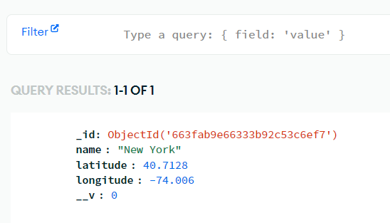
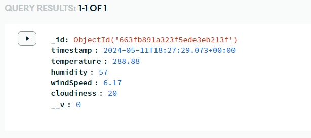

# Weather Forecast API

This is a RESTful API for providing real-time weather forecasts based on geographical locations.

## Getting Started

To run the Weather Forecast API locally, follow these steps:

1. Clone this repository to local machine.

2. Install dependencies using npm:

   ```bash
   npm install
   ````
3. Set up environment variables:

    Create a .env file in the root directory of the project and add the following environment variables:
    ```
    PORT=3000
    MONGODB_URI=<MongoDB connection string>
    OPENWEATHERMAP_API_KEY=<OpenWeatherMap API key>
    ```
4. Run the application:
    ```
    npm start
    ```
## Testing Endpoints:
- /locations (GET, POST):
    `Request Body`
    ``` json 
       
    {
        "name": "New York",
        "latitude": 40.7128,
        "longitude": -74.0060
    }
    ```
    

- /locations/<locationId>:
    `GET Method`
    ```json
    Response Body: 
    {
        "_id": "663fab9e66333b92c53c6ef7",
        "name": "New York",
        "latitude": 40.7128,
        "longitude": -74.006,
        "__v": 0
    }
    ```
- /weather/<locationId>:
    `GET Method`
    ```json
    Response Body: 
    {
        "temperature": 288.88,
        "humidity": 57,
        "windSpeed": 6.17,
        "cloudiness": 20
    }
    ```
    
- /history:
    `GET Method`
    ```json
    Response Body: 
    [
        {
            "_id": "663fb891a323f5ede3eb213f",
            "timestamp": "2024-05-11T18:27:29.073Z",
            "temperature": 288.88,
            "humidity": 57,
            "windSpeed": 6.17,
            "cloudiness": 20,
            "__v": 0
        }
    ]
    ```
